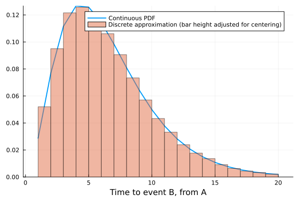
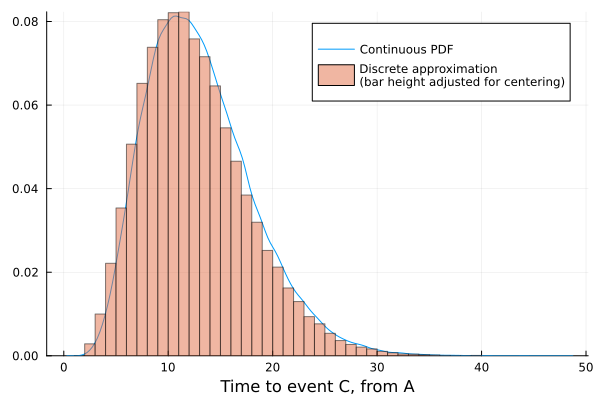

# Double Censoring

The motivation for this package is simplifying the simulation of continuous waiting time distributions in discrete time.
For example say I have some complex dynamic model where after event $A$ occurs there we know in the real world $\mathrm{Gamma}(3.1, 2.1)$ is a good approximation for the time until event $B$ occurs.

If I am running this model in discrete time with a relative time step of 0.1, I can use the following code to simulate this:
```julia
using DiscreteDistributions, Distributions, Random

continuous_waiting_time = truncated(Gamma(3.1, 2.1), upper = 20.0) #advisable to bound the distribution or manually trim tails (will be some [x, ∞) interval)])

time_step = 1//1
discrete_waiting_time = discretize(continuous_waiting_time, time_step, method = :left_aligned)
discrete_waiting_time.support ./= time_step
```

Then discrete_waiting_time can be used to simulate the number of discrete steps until the event occurs, with each $x ~ \mathrm{discrete_waiting_time}$ representing that the event occurs in the interval $[x, x + 1)$

This approximates the continuous distribution well (after adjusting for left-alignment of the intervals):


Comparing summary values:

| Summary | Continuous Distribution | Discrete Approximation |
| ------------- | ------------- | ------------- | 
| Mean | 6.5 | 6.5 |
| Median | 5.87 | 5.5 |
| Variance | 12.23 | 12.32 |

Double censoring accounts for the idea that the time of event A (or another subsequent event is also censored this way).
See these [slides](https://nfidd.github.io/sismid/sessions/biases-in-delay-distributions.html) for a write up of this concept and the importance of account for it when estimating delay distributions. [CensoredDistributions.jl](https://github.com/EpiAware/CensoredDistributions.jl) is a Julia implementation of this concept.

However `DiscretizeDistributions` is not intended for estimating/fitting the discretized distributions, rather it is a convenient wrapper for simulation from a fixed or known distribution.
If we have event $C$ that occurs after $B$ with distribution $\mathrm{Gamma}(3.1, 2.1)$ we can simulate this again like so:
```julia
continuous_waiting_time_two = truncated(Gamma(3.1, 2.1), lower = 1, upper = 100)

discrete_waiting_time_two = discretize(continuous_waiting_time_two, time_step, method = :left_aligned)
discrete_waiting_time_two.support ./= time_step
```

This also approximates the continuous distribution reasonably well (after adjusting for left-alignment of the intervals):


Comparing summary values:

| Summary | Continuous Distribution | Discrete Approximation |
| ------------- | ------------- | ------------- | 
| Mean | 13.06 | 13.09 |
| Median | 12.43 | 12.0 |
| Variance | 25.64 | 25.8 |

Hence I don't think double censoring matters that much for the use case of this package.
We do end with the differences in the Medians and the in general the discrete approximation is slightly skewed to the right.
A solution to this would be to try to discretize over both distributions and their convolution, but this hasn't been implemented yet.

See `examples/double_censoring.jl` for the script behind this analysis.